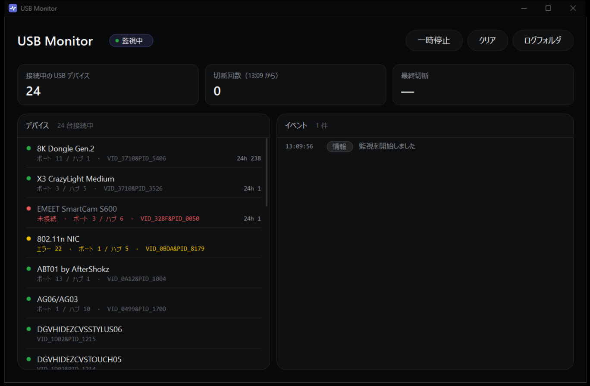

# USB Connect Monitor

USB デバイスが「認識したりしなかったりする」原因を突き止めるための Windows 用ツールです。

- **UsbMonitor.exe** — USB の接続・切断をリアルタイムに表示する監視アプリ（GUI）
- **UsbDiag** — 過去のイベントログを集計して、デバイスごとに原因の候補を出す診断スクリプト

どちらも Windows 標準の機能だけで動き、管理者権限もインストールも不要です。PC の設定は一切変更しません（読み取り専用）。



## 動作環境

- Windows 10 / 11
- .NET Framework 4.x（Windows に標準で入っています）
- Windows PowerShell 5.1

## UsbMonitor（監視アプリ）

### 使い方

[Releases](https://github.com/namiton/USBConnectMonitor/releases) から `UsbMonitor.exe` をダウンロードして起動します。

v1.0.1 以降の exe は、GitHub Actions がタグのソースからビルドしたものです（[release.yml](.github/workflows/release.yml)）。コード署名はしていないため、初回起動時に SmartScreen の確認が出ます。ダウンロードしたファイルが改ざんされていないかは、リリースに載っている SHA256 と照合して確認できます。

```bash
powershell -NoProfile -Command "(Get-FileHash .\UsbMonitor.exe -Algorithm SHA256).Hash"
```

| 画面の要素 | 内容 |
|---|---|
| 統計カード | 接続中の台数 / 起動してからの切断回数 / 最後に切断した時刻と機器名 |
| デバイス | 切断の多い順に並ぶ。緑 = 正常、赤 = 未接続、黄 = エラー・認識失敗。ポート/ハブ番号、今回の切断回数、直近 24 時間の切断回数を表示 |
| イベント | 切断・接続・異常を新しい順に表示。復帰までの秒数も出る |

- デバイスをクリックすると、そのデバイスのイベントだけに絞り込み（Esc で解除）
- Ctrl+C で選択中デバイスのインスタンス ID をコピー
- イベントは exe と同じフォルダの `reports\usbmonitor_yyyyMMdd.log` に自動保存

### 検出の仕組み

- **切断**: イベントログ `Microsoft-Windows-Kernel-PnP/Device Management` の ID 1010 / 1011（突然の取り外し）を購読して検出。1 秒未満の瞬断も取りこぼさない
- **接続・エラー状態**: 1 秒ごとに `cfgmgr32` でデバイス一覧を取得して差分を検出
- 手で抜いた場合も同じ切断として記録されます

### ビルド

.NET SDK は不要です。Windows 同梱の `csc.exe` でビルドします。

```bash
powershell -NoProfile -ExecutionPolicy Bypass -File UsbMonitor/build.ps1
```

`UsbMonitor/bin/UsbMonitor.exe` が生成されます（アイコンもスクリプトで生成）。

## UsbDiag（診断スクリプト）

`UsbDiag/UsbDiag.bat` をダブルクリックすると、過去 14 日分を診断してレポートを表示します。

- スリープ・復帰・起動の前後 90 秒の切断は正常とみなして除外
- 他のデバイスと同時（±3 秒）に切れていれば「ハブ・コントローラ・給電など上流側」、単独なら「そのデバイス・ケーブル・ポート」と判定
- 無線ドングル・高ポーリングレート（4K/8K Hz）・省電力設定なども考慮して、原因候補を「高・中・低」で提示し、試すべき対策を表示
- 切断が 2 回以下のデバイスは判断材料不足として扱う
- レポート（テキスト）と切断イベント一覧（CSV）を `UsbDiag\reports\` に保存

```bash
powershell -NoProfile -ExecutionPolicy Bypass -File UsbDiag/UsbDiag.ps1 -Days 3
```

| オプション | 内容 |
|---|---|
| `-Days <n>` | 診断する期間（既定 14 日） |
| `-Top <n>` | 表示するデバイス数（既定 5） |
| `-Watch` | コンソールでリアルタイム監視（`UsbDiag_Watch.bat` と同じ） |

## 安全性とプライバシー

- **PC の設定は変更しません。** レジストリ・電源設定・デバイスの有効/無効などには一切触れず、イベントログとデバイス情報を読むだけです。書き込むのはツールのフォルダ内の `reports\` へのログとレポートだけです
- **通信しません。** 管理者権限も使いません
- **DLL は System32 からだけ読み込みます。** exe と同じフォルダに置かれた同名の DLL は読み込みません
- **デバイス名は無害化して扱います。** デバイス名は USB 機器自身が申告する文字列のため、制御文字を取り除き、CSV では数式として解釈されないようにしています
- **ログとレポートには接続機器のシリアル番号が含まれます。** 不具合報告などで人に共有するときは、該当部分を伏せてください

## ライセンス

[MIT License](LICENSE) — Copyright (c) 2026 @Namiton
